# 🧠 Resume Radar - ATS Powered Resume Analyzer

**An NLP-driven resume-analysis system that extracts key insights, matches skills with job descriptions, evaluates experience & education relevance, and generates ATS-style scoring through a modern, interactive dashboard powered by Flask.**

## 🔗 **Live Website:** [Link](https://resumeradar-1c77.onrender.com/)

---

## 📌 What is ATS Resume Analysis?

ATS (Applicant Tracking System) resume evaluation simulates how modern recruiting systems parse, analyze, and rank resumes.
This project performs a complete NLP-based breakdown of a candidate’s resume:
- Extracts name, email, phone
- Detects skills, education, experience
- Matches them with job description requirements
- Computes an ATS score
- Generates an interactive, visual analysis dashboard
- The result? A professional, actionable resume assessment instantly.

---

## 🚀 Project Highlights

- ⚡ **Instant ATS Analysis** - Complete breakdown in under 5 seconds
- 🧠 **Advanced NLP Pipelines** to extract structured resume data
- 🎯 **Skill Matching Engine** for technical & soft skills
- 📊 **Interactive Dashboard** built using Chart.js
- 📑 **Experience Parsing** with intelligent date handling
- 🧾 **Education Analysis** with domain-based classification
- 🔍 **Section Coverage Detection** for resume completeness
- 🔐 **100% Privacy** - No data is stored
- ⬇️ **Donwload Report** - Users can save their results in a standard report format
- 🌐 Fully responsive, glass-morphism themed UI

---

## 🏗️ System Architecture

The Smart Resume Analyzer follows a modular NLP pipeline:

### **1. Text Extraction Layer**
Extracts text from:
- PDFs using PyMuPDF
- DOCX using python-docx

### **2. Information Extraction Layer**
- Contact extraction
- Skill extraction
- Section detection
- Education parsing
- Experience timeline extraction

### **3. Skill Matching Engine**
- Canonical skill normalization  
- Technical + soft skill libraries  
- JD-to-resume skill comparison  
- Abbreviation and synonym detection  

### **4. Scoring Layer**
Generates:
- ATS Score
- Skills Match Score
- Action Verb Density Score
- Resume Length Score
- Section Coverage Score

### **5. Visualization Layer**
- TailwindCSS UI  
- Chart.js graphs  
- Glass-morphism themed dashboard  

---

## 📂 Dataset & Resource Files

The analyzer uses custom JSON datasets for:

- 🎓 Education domains & degree mappings
- 🛠️ Technical skills library
- 🤝 Soft skills
- ⚡ Action verbs for resume impact scoring
- 📑 Section keywords

All datasets are optimized for high-accuracy matching.

---

## 🛠️ Tech Stack

| Layer | Technology |
|:------|:------------|
| **Language** | Python, JavaScript |
| **Backend** | Flask |
| **NLP & Processing** | PyMuPDF, python-docx, dateparser, regex |
| **Frontend** | HTML, CSS, TailwindCSS |
| **Charts & Visualization** | Chart.js |
| **Version Control** | Git, GitHub |

---

## 🧪 Key Analysis Metrics

| Metric | Description |
|:------|:------------|
| **ATS Score** | Overall resume compatibility with job description |
| **Skill Match** | Percentage match for both technical & soft skills |
| **Action Verb Density** | Measures strength & impact of resume wording |
| **Experiene Match** | Checks if experience meets JD requirements |
| **Education Match** | Validates degree/domain relevance |
| **Section Coverage** | Detects missing or incomplete resume sections |
| **Resume Length** | Evaluates optimal word count based on experience |

---

## 🌐 Project UI Screens

### 🖥️ Home Page with Resume upload

  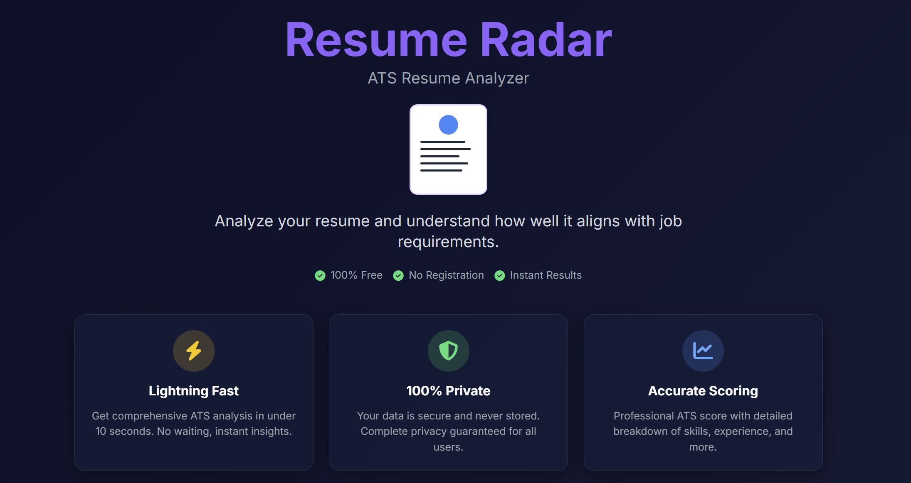
  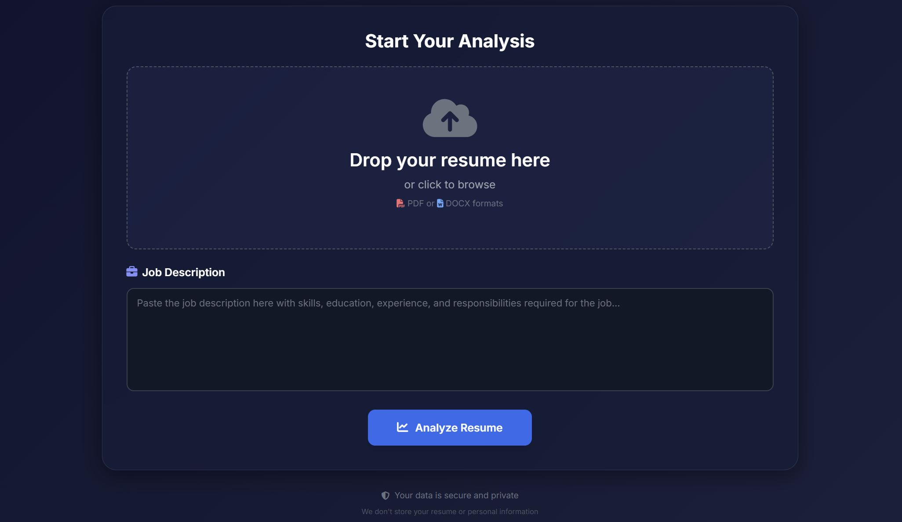
  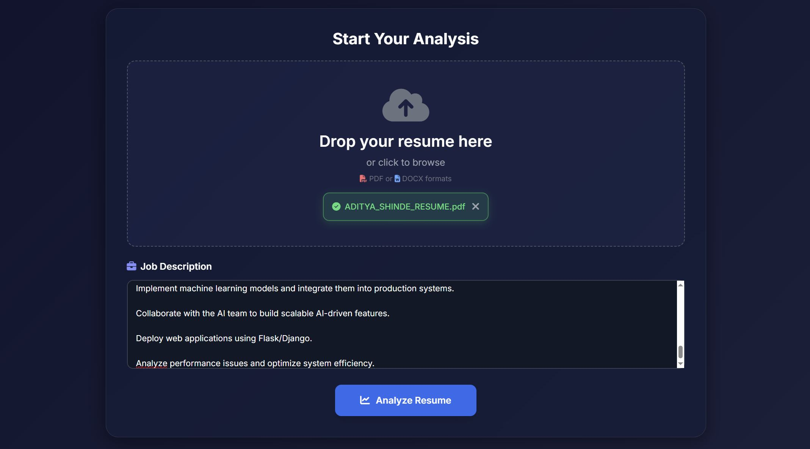

---

## 📈 ATS Insights with dashboard

  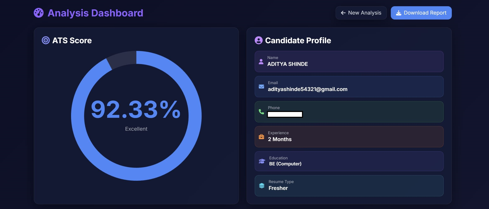
  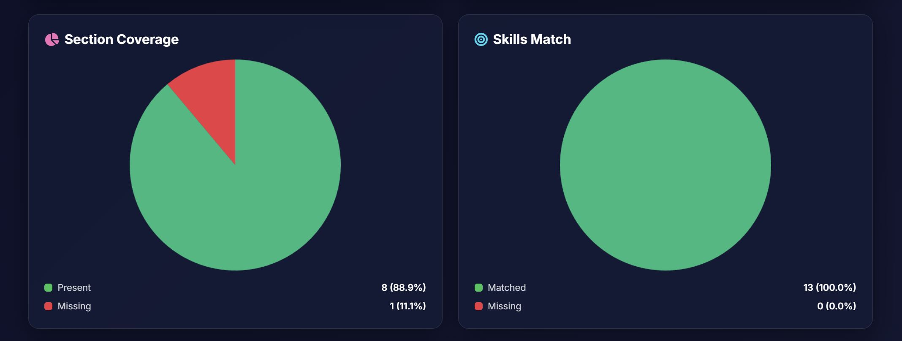
  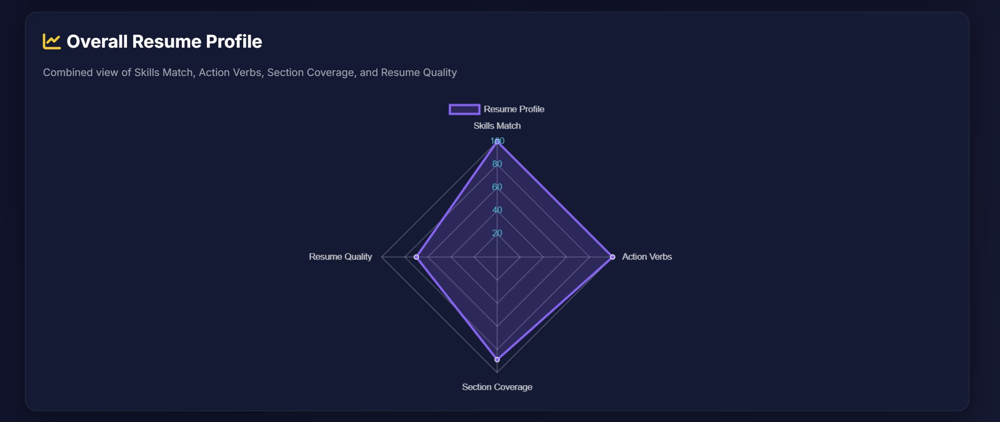
  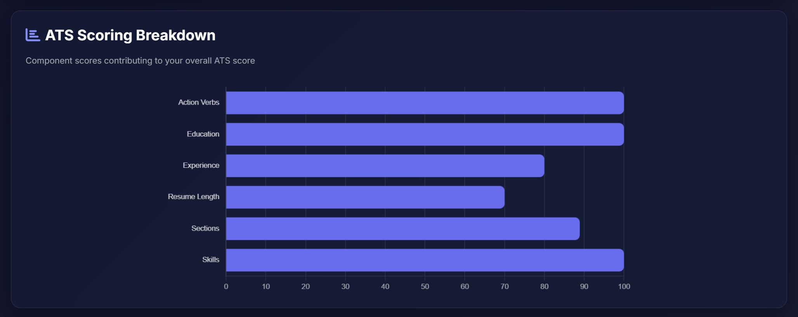
  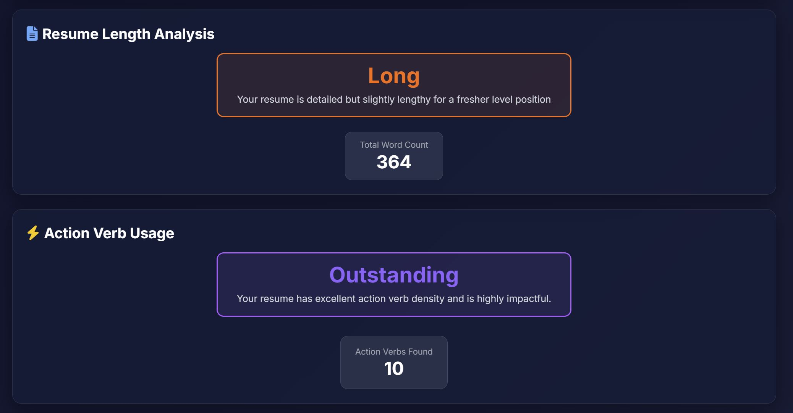
  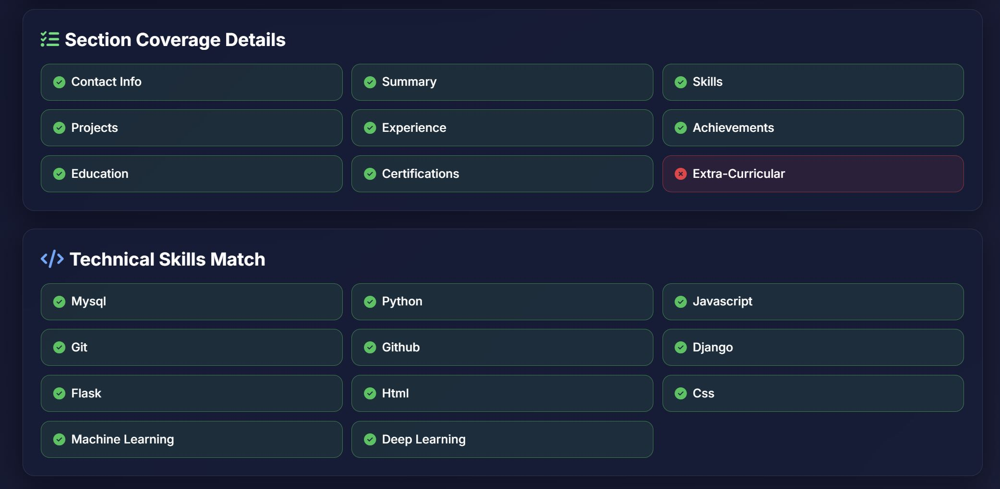
  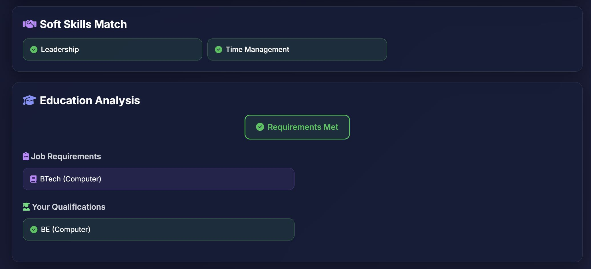
  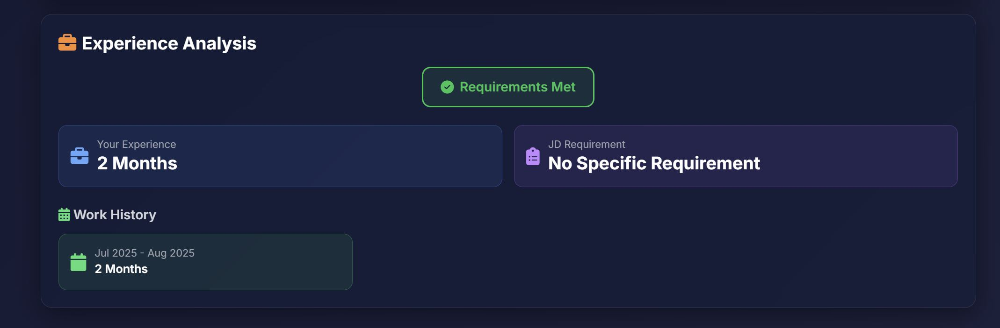

---

## 🧾 Generated Report

  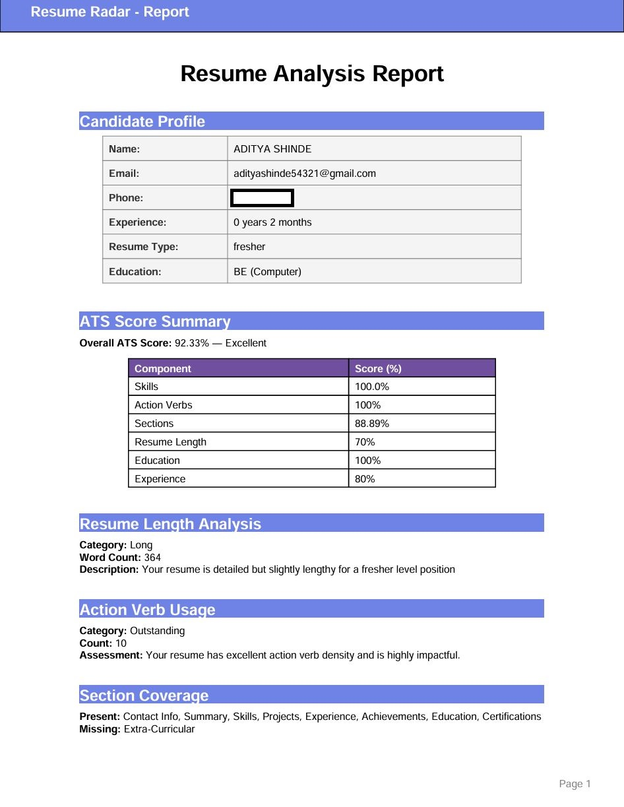
  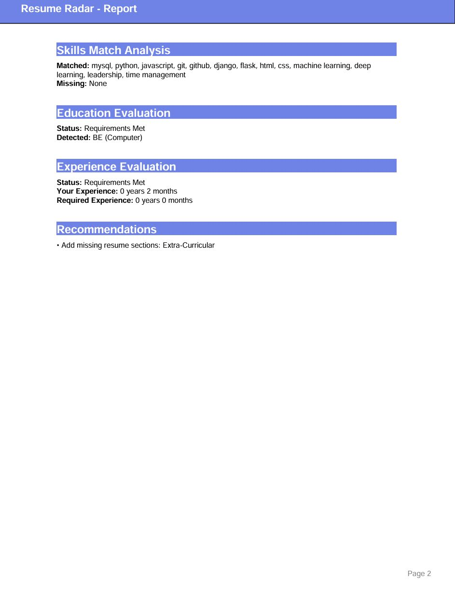

